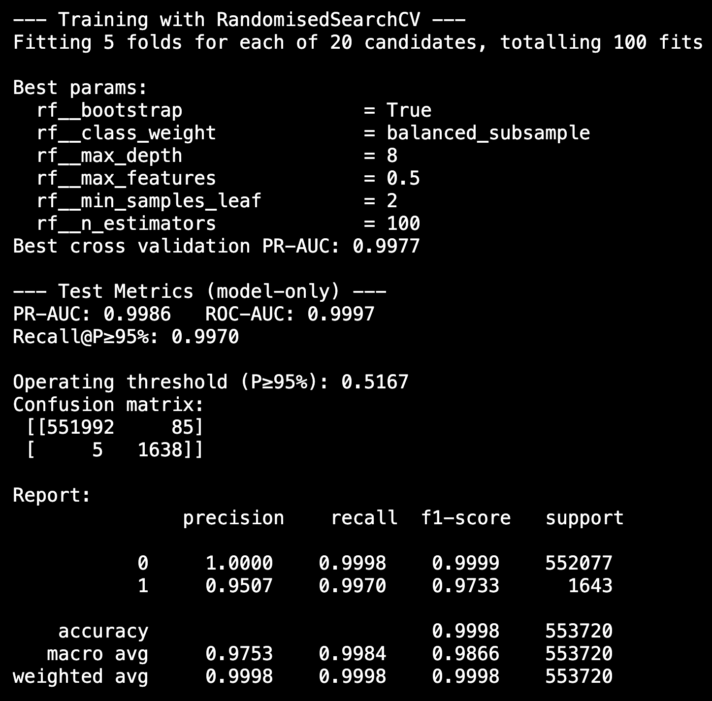

# fraud-detection-pipeline

## How to use

**0) Setup**

```bash
python -m venv .venv && source .venv/bin/activate   # Windows: .venv\Scripts\activate
pip install -r requirements.txt
```

**1) EDA**

* Open `notebooks/01_eda.ipynb` and run all cells.

**2) Preprocess**

```bash
python src/data_prep.py
# outputs: data/processed.csv
```

**3) Train (Random Forest)**

```bash
python src/train_rf.py
# outputs: models/fraud_rf.pkl, models/rf_metrics.json
```

**4) (Optional) Train LightGBM**

```bash
python src/train_lgbm.py   # TODO
# expected: models/fraud_lgbm.pkl, models/lgbm_metrics.json
```

**5) Compare & choose**

* Compare `*_metrics.json` on **PR-AUC** and **Recall\@Precision≥95%**.
* Pick the better model for serving (save as `models/fraud_best.pkl`).


## Model training

**Feature selection (no leakage):**

* `transac_type`, `amount` — core fraud signals seen in EDA.
* `hour`, `day_of_week` — temporal patterns (off-hours spikes).
* `src_bal`, `dst_bal` — transaction context (ability/impact).
* `flag_any_inconsistency` — data-integrity red flags.
* `amount_over_src` = `amount / src_bal` — fraudsters often move (near) all funds.
* Dropped: `src_new_bal`, `dst_new_bal` (deterministic from balances + amount → leakage); account IDs.

**Hybrid design & algorithm choice:**

* **Rules first (deterministic, auditable):**

  * `is_flagged_fraud == 1` (amount > 200,000) → label fraud.
  * Non-risk types from TRAIN EDA (`CASH_IN`, `DEBIT`, `PAYMENT`) had 0 fraud → routed as non-fraud unless simple red flags apply (documented in API).
* **ML next (subtle patterns):**

  * Chosen: **RandomForest** (handles non-linearities, mixed features, robust, fast to deploy).
  * Baselines: Logistic Regression (kept simple; weaker on interactions); SVM skipped (doesn’t scale to \~6M).
  * **LightGBM/XGBoost**: strong candidates for tabular data; to be benchmarked and the best saved as `models/fraud_best.pkl`.

**Parameter tuning:**

* **RandomizedSearchCV** (Stratified 5-fold), scoring=`average_precision` (PR-AUC).
* Key params only (insight-driven): `n_estimators`, `max_depth`, `min_samples_leaf`, `max_features`, `class_weight`, `bootstrap` (for speed/variance).
* Trained on **risk types only**; rule-hits excluded from TRAIN to avoid re-learning hard rules.

**Metrics (what we report):**

* **Primary:** PR-AUC (Average Precision) — focuses on positives; robust under heavy imbalance.
* **Operational:** **Recall\@Precision ≥ 95%** — “at ≥95% precision, what % of fraud do we catch?”
* **At chosen operating threshold** (smallest threshold achieving ≥95% precision): Precision, Recall, F1, and the **threshold value**.
* **Reference:** ROC-AUC and confusion matrix.

**Model comparison:**
Models are compared by **PR-AUC + Recall\@Precision≥95%**; the higher-performing model at the chosen operating point is selected for serving.

### Model performance report


**Best params (RandomizedSearchCV):**
`bootstrap=True, class_weight=balanced_subsample, max_depth=8, max_features=0.5, min_samples_leaf=2, n_estimators=100`

**Test (model-only):**

* PR-AUC: **0.9986** ROC-AUC: **0.9997**
* Recall\@Precision ≥ **95%**: **0.9970** (threshold **0.5167**)
* Confusion matrix: TN **551,992**, FP **85**, FN **5**, TP **1,638**

**Interpretation:**

* Precision ≈ **95%** → \~**5%** of alerts are false alarms.
* Recall ≈ **99.7%** → model catches **almost all** fraud in test (only **5** missed).

* False Positive (FP) = predict fraud but it’s actually normal.
 → Customer inconvenience (declines/holds), blocked transactions/cards, reputational hit, operational review cost.

* False Negative (FN) = predict normal but it’s actually fraud.
 → Direct financial loss/chargebacks, legal/compliance risk, downstream fraud, loss of customer trust.

In fraud, FNs usually cost more but too many FPs still anger customers → choose a threshold P≥95% to balance.